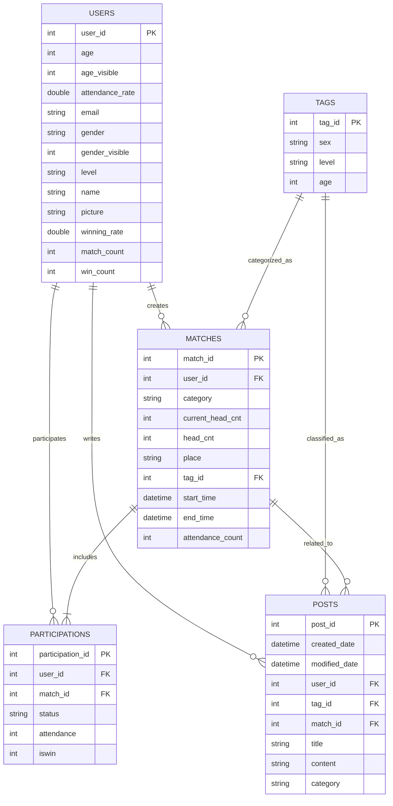

```mermaid
erDiagram
    USERS {
        int user_id PK 
        int age
        int age_visible
        double attendance_rate
        string email
        string gender
        int gender_visible 
        string level
        string name 
        string picture
        double winning_rate
        int match_count
        int win_count 
    }
    
    TAGS {
        int tag_id PK 
        string sex
        string level
        int age
    }

    POSTS {
        int post_id PK 
        datetime created_date
        datetime modified_date 
        int user_id FK
        int tag_id FK
        int match_id FK
        string title 
        string content
        string category 
    }

    MATCHES {
        int match_id PK
        int user_id FK
        string category
        int current_head_cnt
        int head_cnt
        string place 
        int tag_id FK
        datetime start_time 
        datetime end_time 
        int attendance_count 
    }

    PARTICIPATIONS {
        int participation_id PK 
        int user_id FK
        int match_id FK
        string status
        int attendance 
        int iswin
    }

    USERS ||--o{ PARTICIPATIONS : "participates"
    USERS ||--o{ POSTS : "writes"
    USERS ||--o{ MATCHES : "creates"
    TAGS ||--o{ POSTS : "classified_as"
    TAGS ||--o{ MATCHES : "categorized_as"
    MATCHES ||--o{ POSTS : "related_to"
    MATCHES ||--|{ PARTICIPATIONS : "includes"
```
